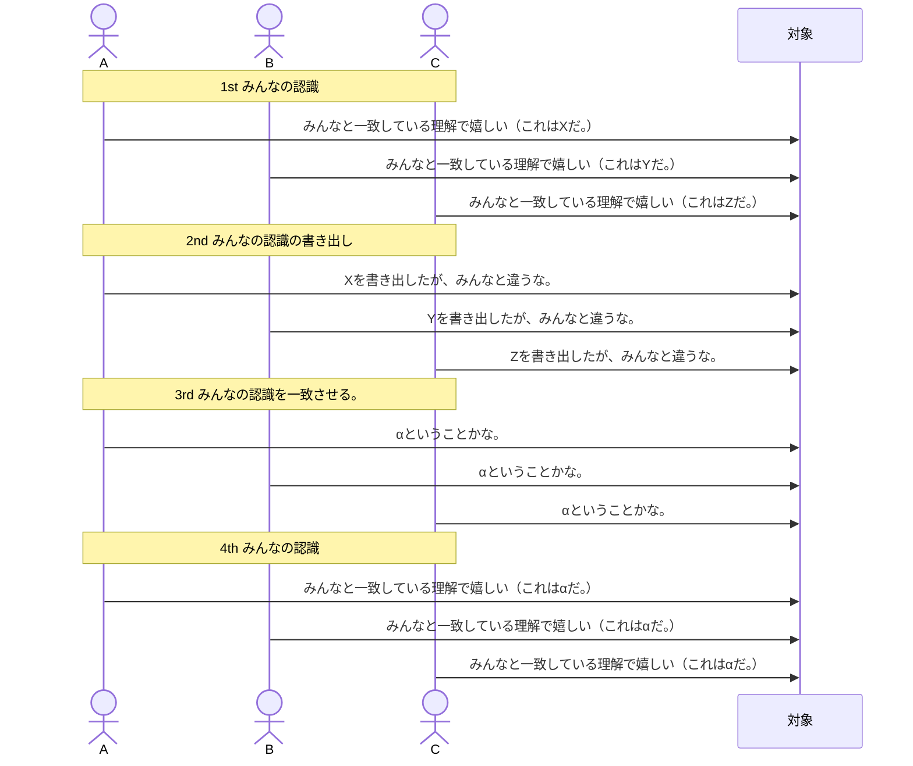

# 前書き

## ストーリーマップとは
ストーリーマップを作ると私たちはユーザーとそのエクスペリエンスに意識を集中でき、より良い会話を交わすことができ、最終的に良い製品が生まれる。

## 対象者
ストーリーで苦しんでいる人
- 全体像を見失った状態
- 何を作っているのかわからなくなっている状態
- 期限までにものを作れなくなっている状態

（すでにストーリーを作っている方向けなイメージ）

# まず最初に読むこと
（この本にはイントロがないらしい。）

## もっともこの本で重要なこと
__ストーリーを使う目的は、よいストーリーを書くことではない。__
__製品開発の目標は、製品を作ることではない。__

## 伝言ゲーム
子供のころによくあるゲームだが、実は大人の世界でも伝言ゲーム状態が多い。
同じ指示でも受け手によって違う解釈をしてしまう。

伝言ゲームでミスしてしまう例
- ケーキ屋さんの例
  - https://www.cakewrecks.com/
- NASAの例（ヤード・ポンド法/メートル法の認識違い）
  - https://wired.jp/1999/10/04/%e7%81%ab%e6%98%9f%e6%8e%a2%e6%9f%bb%e6%a9%9f%e4%ba%8b%e6%95%85%e3%81%ae%e5%8e%9f%e5%9b%a0%e3%81%af%e6%b8%ac%e5%ae%9a%e5%8d%98%e4%bd%8d%e7%b3%bb%e3%81%ae%e6%b7%b7%e4%b9%b1/

__共有ドキュメントは共通理解ではない。__
共通理解があるとは、互いに理解しており、その理由を理解していること。

## 共通理解の構築はシンプルである。
互いに言葉や絵を介して共通的な理解を作っていく。（ただし、共通理解を得られたということにはつかみどころはない。）

## 完璧なドキュメントを作るのはやめる。
結局は完璧なドキュメントはない。会話することによってのみ共通理解が得られる。

__ストーリーを作る本当の目的は、共通理解をつかむことである。__

## ドキュメントは旅行写真のようなもの。
旅行写真を見たらその時の状況を思い出せる。それはその時その場に居合わせていたからである。ほかの方は誰も理解できない。

ドキュメントについても同じようなことが言える。
ドキュメントは同じ場で何度も会話したため、ドキュメントにない細かな内容も含まれる。
議論の場にいなかった方に共有する際には場を共有してドキュメントを通してストーリーを伝える。

## 記憶を助けるためのドキュメント
たくさんのメモを書き、たくさん話し、記憶に残るように写真を残す。

__記憶を助けるために、会話の結果を写真に撮ったり、短いビデオにまとめたりしよう。__

## 正しいことをする。

__本当の仕事は世界を変えることである。__

## 大切なのはソフトウェアではない。
アイデアからデリバリーまでのアイデアをアウトプットという。
アウトプットは成果（アウトカム）とは異なる。
成果というのはモノが世の中に出た後にどういった変化が生まれるかである。

__ストーリーについての会話では、単に作ろうとしているものについて話すのではなく、だれのためか、なぜなのかも話す。__

## 大切なのは人だけではない。

__顧客やユーザーが欲しいものを手に入れられない限り、あなたの会社は欲しいものを手に入れられない。__

## 作るものを減らす。

__いつも私たちが持っている時間やリソース以上に作るべきものが存在する。__

__アウトプットを最小限に抑え、最大限の成果とインパクトを獲得しよう。__

## まとめ

- ストーリーは要件を形式に落とし込むためのものではない。言葉と絵を使いながら話すのは、共通理解を築くためのメカニズムだ。
- ストーリーは要件ではない。会社、顧客、ユーザーが抱える問題の解決についての議論であり、何を作るかについての意見を一致に導くものだ。
- あなたがしなければならないことは、より早くより多くのソフトウェアを作ることではない。作ると決めたものから最大限の成果とインパクトを生み出すことだ。

# 全体像

## ストーリーのはじめ
ストーリーというアイデアはすでに古いもの
ケント・ベック：エクストリームプログラミングを作り、ストーリーのアイデアを初めて文章にした人物
ケントたちは、これまで要件を満たすために行われてきたあらゆる方法が機能していないことをよく知っていた。
ケントのアイデアはみんなで集まってそれぞれのストーリーを話すというシンプルなものであった。

## 書くのではなくストーリーを語る。

__ストーリーがストーリーとして呼ばれているのは何をかくべきかではなくそれをどのように使うべきだからだ。__

## 全体像を話す。
__ストーリーマッピングとは大きなストーリーを話しながら小さく分割していくことである。__

## フラットバックログ
ゲイリーレヴィットさんの体験談：（ストーリーマッピングなし）ほしい機能をリストアップし優先順位をつけて取り組んでいたが、なかなかできなかった。
そこでゲイリーさんは著者に助けを求めた。

## 話して記録
著者はゲイリーレヴィットさんと一緒にストーリーマップをし、話して記録することを行った。
__話して記録：ストーリーを話しながらカードかポストイットに考えていることを書き出して思考を表出化しよう__

考える→書き出す→説明する→並べる。
せっかくアイデアの蒸発はかなりもったいない。

## アイデアの枠組みを作る。
また、その中では著者はゲイリーが作りたいアウトプットではなく、それが実現することによって得られる成果を理解しようと努めていた。

## ユーザーのストーリーを話す。

__何も言わずにカードを並び替えるだけでコミュニケーションできる。__
__ストーリーマッピングによって思考の穴が見つかりやすくなる。__
__ひとつのストーリーを掘り下げる前に、全体としてどのようなストーリーがあるのかを明らかにしよう。__

